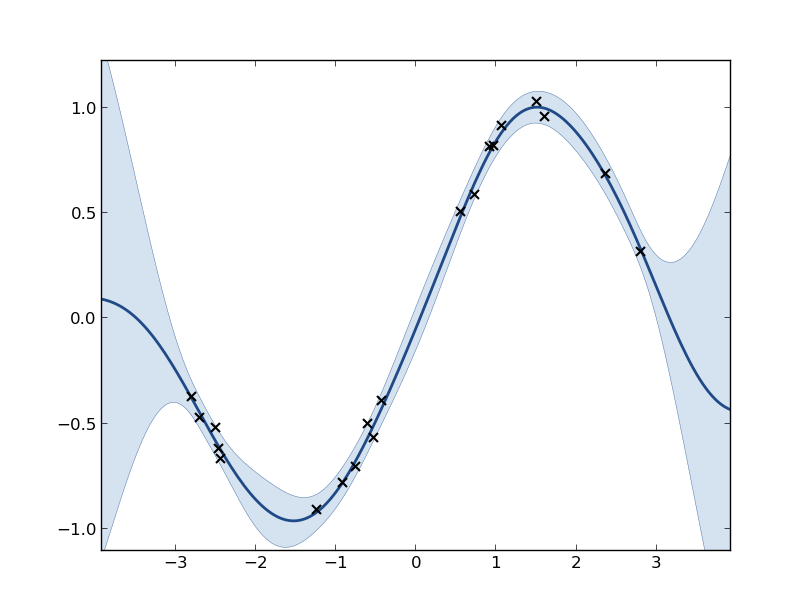
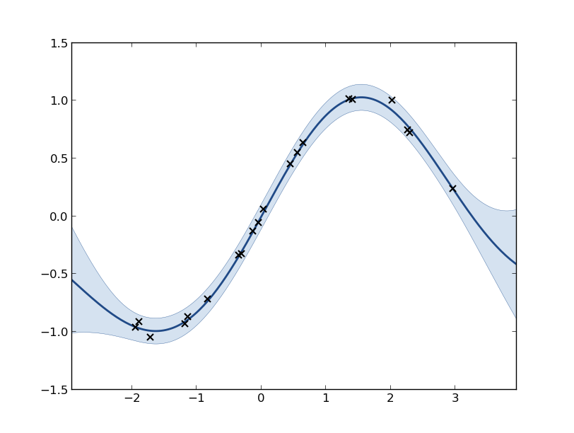
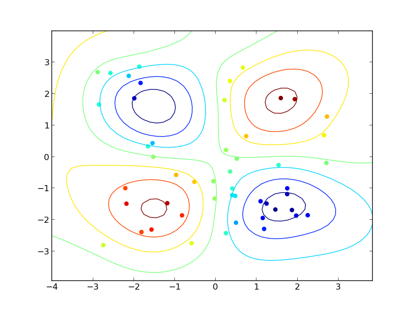

*************************************
Gaussian process regression tutorial
*************************************

We will see in this tutorial the basics for building a 1 dimensional and a 2 dimensional Gaussian process regression model, also known as a kriging model. The code shown in this tutorial can be obtained at GPy/examples/tutorials.py, or by running ``GPy.examples.tutorials.tuto_GP_regression()``.

We first import the libraries we will need: ::

    import pylab as pb
    pb.ion()
    import numpy as np
    import GPy

1-dimensional model
===================

For this toy example, we assume we have the following inputs and outputs::

    X = np.random.uniform(-3.,3.,(20,1))
    Y = np.sin(X) + np.random.randn(20,1)*0.05

Note that the observations Y include some noise.

The first step is to define the covariance kernel we want to use for the model. We choose here a kernel based on Gaussian kernel (i.e. rbf or square exponential)::

    kernel = GPy.kern.rbf(input_dim=1, variance=1., lengthscale=1.)

The parameter ``input_dim`` stands for the dimension of the input space. The parameters ``variance`` and ``lengthscale`` are optional. Many other kernels are implemented such as:

* linear (``GPy.kern.linear``)
* exponential kernel (``GPy.kern.exponential``)
* Matern 3/2 (``GPy.kern.Matern32``)
* Matern 5/2 (``GPy.kern.Matern52``)
* spline (``GPy.kern.spline``)
* and many others...

The inputs required for building the model are the observations and the kernel::

    m = GPy.models.GPRegression(X,Y,kernel)

By default, some observation noise is added to the modle. The functions ``print`` and ``plot`` give an insight of the model we have just build. The code::

    print m
    m.plot()

gives the following output: ::

    Marginal log-likelihood: -4.479e+00
           Name        |  Value   |  Constraints  |  Ties  |  Prior  
    -----------------------------------------------------------------
       rbf_variance    |  1.0000  |               |        |         
      rbf_lengthscale  |  1.0000  |               |        |         
      noise_variance   |  1.0000  |               |        |         

    GP regression model before optimization of the parameters. The shaded region corresponds to 95% confidence intervals (ie +/- 2 standard deviation).

The default values of the kernel parameters may not be relevant for the current data (for example, the confidence intervals seems too wide on the previous figure). A common approach is to find the values of the parameters that maximize the likelihood of the data. There are two steps for doing that with GPy:

* Constrain the parameters of the kernel to ensure the kernel will always be a valid covariance structure (For example, we don\'t want some variances to be negative!).
* Run the optimization

There are various ways to constrain the parameters of the kernel. The most basic is to constrain all the parameters to be positive::

    m.ensure_default_constraints() # or similarly m.constrain_positive('')

but it is also possible to set a range on to constrain one parameter to be fixed. The parameter of ``m.constrain_positive`` is a regular expression that matches the name of the parameters to be constrained (as seen in ``print m``). For example, if we want the variance to be positive, the lengthscale to be in [1,10] and the noise variance to be fixed we can write::

    m.unconstrain('')               # may be used to remove the previous constrains
    m.constrain_positive('.*rbf_variance')
    m.constrain_bounded('.*lengthscale',1.,10. )
    m.constrain_fixed('.*noise',0.0025)

Once the constrains have been imposed, the model can be optimized::

    m.optimize()

If we want to perform some restarts to try to improve the result of the optimization, we can use the ``optimize_restart`` function::

    m.optimize_restarts(num_restarts = 10)

Once again, we can use ``print(m)`` and ``m.plot()`` to look at the resulting model  resulting model::

    Marginal log-likelihood: 3.603e+01
           Name        |  Value   |  Constraints  |  Ties  |  Prior  
    -----------------------------------------------------------------
       rbf_variance    |  0.8151  |     (+ve)     |        |         
      rbf_lengthscale  |  1.8037  |  (1.0, 10.0)  |        |         
      noise_variance   |  0.0025  |     Fixed     |        |         

    GP regression model after optimization of the parameters.

2-dimensional example
=====================

Here is a 2 dimensional example::

    import pylab as pb
    pb.ion()
    import numpy as np
    import GPy

    # sample inputs and outputs
    X = np.random.uniform(-3.,3.,(50,2))
    Y = np.sin(X[:,0:1]) * np.sin(X[:,1:2])+np.random.randn(50,1)*0.05

    # define kernel
    ker = GPy.kern.Matern52(2,ARD=True) + GPy.kern.white(2)

    # create simple GP model
    m = GPy.models.GPRegression(X,Y,ker)

    # contrain all parameters to be positive
    m.constrain_positive('')

    # optimize and plot
    m.optimize('tnc', max_f_eval = 1000)
    m.plot()
    print(m)

The flag ``ARD=True`` in the definition of the Matern kernel specifies that we want one lengthscale parameter per dimension (ie the GP is not isotropic). The output of the last two lines is::

    Marginal log-likelihood: 6.682e+01
             Name          |  Value   |  Constraints  |  Ties  |  Prior  
    ---------------------------------------------------------------------
        Mat52_variance     |  0.3860  |     (+ve)     |        |         
      Mat52_lengthscale_0  |  2.0578  |     (+ve)     |        |         
      Mat52_lengthscale_1  |  1.8542  |     (+ve)     |        |         
        white_variance     |  0.0023  |     (+ve)     |        |         
        noise variance     |  0.0000  |     (+ve)     |        |         

    Contour plot of the mean predictor (posterior mean).
