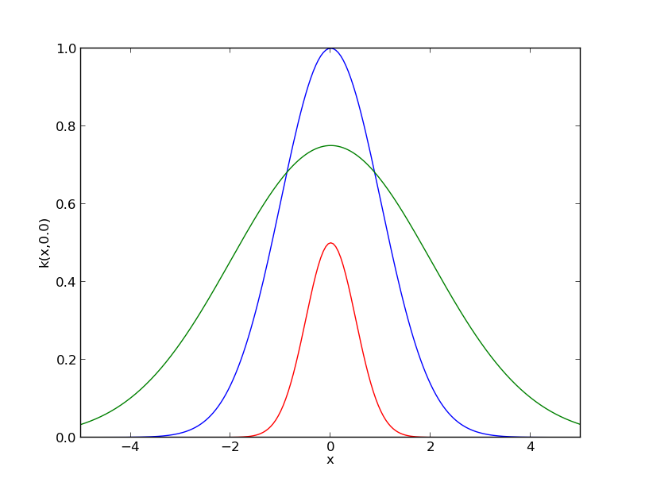
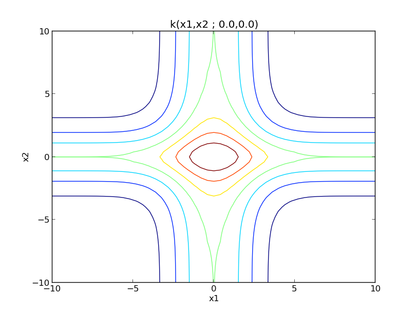

****************************
tutorial : A kernel overview
****************************

First we import the libraries we will need ::

    import pylab as pb
    import numpy as np
    import GPy
    pb.ion()

For most kernels, the dimension is the only mandatory parameter to define a kernel object. However, it is also possible to specify the values of the parameters. For example, the three following commands are valid for defining a squared exponential kernel (ie rbf or Gaussian) ::

    ker1 = GPy.kern.rbf(D=1)  # Equivalent to ker1 = GPy.kern.rbf(D=1, variance=1., lengthscale=1.)
    ker2 = GPy.kern.rbf(D=1, variance = 1.5, lengthscale=2.)
    ker3 = GPy.kern.rbf(1, .5, .5)

A `plot` and a `print` functions are implemented to represent kernel objects ::
    
    print ker1

    ker1.plot()
    ker2.plot()
    ker3.plot()

::

    import pylab as pb
    import numpy as np
    import GPy
    pb.ion()

    ker1 = GPy.kern.rbf(D=1)  # Equivalent to ker1 = GPy.kern.rbf(D=1, variance=1., lengthscale=1.)
    ker2 = GPy.kern.rbf(D=1, variance = .75, lengthscale=3.)
    ker3 = GPy.kern.rbf(1, .5, .25)

    ker1.plot()
    ker2.plot()
    ker3.plot()
    #pb.savefig("Figures/tuto_kern_overview_basicdef.png")

    kernels = [GPy.kern.rbf(1), GPy.kern.exponential(1), GPy.kern.Matern32(1), GPy.kern.Matern52(1),  GPy.kern.Brownian(1), GPy.kern.bias(1), GPy.kern.linear(1), GPy.kern.spline(1), GPy.kern.periodic_exponential(1), GPy.kern.periodic_Matern32(1), GPy.kern.periodic_Matern52(1), GPy.kern.white(1)]
    kernel_names = ["GPy.kern.rbf", "GPy.kern.exponential", "GPy.kern.Matern32", "GPy.kern.Matern52", "GPy.kern.Brownian", "GPy.kern.bias", "GPy.kern.linear", "GPy.kern.spline", "GPy.kern.periodic_exponential", "GPy.kern.periodic_Matern32", "GPy.kern.periodic_Matern52", "GPy.kern.white"]
    
    pb.figure(figsize=(16,12))
    pb.subplots_adjust(wspace=.5, hspace=.5)
    for i, kern in enumerate(kernels):
       pb.subplot(3,4,i+1)
       kern.plot(x=7.5,plot_limits=[0.00001,15.])
       pb.title(kernel_names[i]+ '\n')
       #pb.axes([.1,.1,.8,.7])
       #pb.figtext(.5,.9,'Foo Bar', fontsize=18, ha='center')
       #pb.figtext(.5,.85,'Lorem ipsum dolor sit amet, consectetur adipiscing elit',fontsize=10,ha='center')

    # actual plot for the noise
    i = 11
    X = np.linspace(0.,15.,201)
    WN = 0*X
    WN[100] = 1.
    pb.subplot(3,4,i+1)
    pb.plot(X,WN,'b')

Implemented kernels
===================

Many kernels are already implemented in GPy. Here is a summary of most of them:

.. figure::  Figures/tuto_kern_overview_allkern.png
    :align:  center
    :height: 800px

On the other hand, it is possible to use the `sympy` package to build new kernels. This will be the subject of another tutorial.

Operations to combine kernel
============================

In ``GPy``, kernel objects can be combined with the usual ``+`` and ``*`` operators. ::
    
    k1 = GPy.kern.rbf(1,variance=1., lengthscale=2)
    k2 = GPy.kern.Matern32(1,variance=1., lengthscale=2)

    ker_add = k1 + k2
    print ker_add

    ker_prod = k1 * k2
    print ker_prod

Note that by default, the operator ``+`` adds kernels defined on the same input space whereas ``*`` assumes that the kernels are defined on different input spaces. ::
    
    ker_add.D
    ker_prod.D

In order to add kernels defined on the different input spaces, the required command is::

    ker_add_orth = k1.add_orthogonal(k2)

The resulting kernel is
    ker_add_orth.plot(plot_limits=[[-10,-10],[10,10]])

Example : Building an ANOVA kernel
==================================

In two dimensions ANOVA kernels have the following form: 

.. math::

    k_{ANOVA}(x,y) = \prod_{i=1}^2 (1 + k_i(x_i,y_i)) = 1 + k_1(x_1,y_1) + k_2(x_2,y_2) + k_1(x_1,y_1) \times k_2(x_2,y_2).

Let us assume that we want to define an ANOVA kernel with a Matern 3/2 kernel for :math:`k_i`. As seen previously, we can define this kernel as follow::

    k_cst = GPy.kern.bias(1,variance=1.)
    k_mat = GPy.kern.Matern52(1,variance=1., lengthscale=3)
    Kanova = (k_cst + k_mat) * (k_cst + k_mat)
    print Kanova

Note the ties between the lengthscales of ``Kanova`` to keep the number of lengthscales equal to 2. On the other hand, there are four variance terms in the new parameterization: one for each term of the right hand sign of the equation above. We can illustrate the use of this kernel on a toy example::

    # sample inputs and outputs
    X = np.random.uniform(-3.,3.,(40,2))
    Y = 0.5*X[:,:1] + 0.5*X[:,1:] + 2*np.sin(X[:,:1]) * np.sin(X[:,1:])

    # Create GP regression model
    m = GPy.models.GP_regression(X,Y,Kanova)
    m.plot()

.. figure::  Figures/tuto_kern_overview_mANOVA.png
    :align:  center
    :height: 350px

As :math:`k_{ANOVA}` corresponds to the sum of 4 kernels, the best predictor can be splited in a sum of 4 functions 

.. math::

    bp(x) & = k(x)^t K^{-1} Y \\
          & = (1 + k_1(x_1) +  k_2(x_2) +  k_1(x_1)k_2(x_2))^t K^{-1} Y \\
          & = 1^t K^{-1} Y + k_1(x_1)^t K^{-1} Y + k_2(x_2)^t K^{-1} Y + (k_1(x_1)k_2(x_2))^t K^{-1} Y

The submodels can be represented with the option ``which_function`` of ``plot``: ::
    
    pb.figure(figsize=(20,5))
    pb.subplots_adjust(wspace=0.5)
    pb.subplot(1,5,1)
    m.plot()
    pb.subplot(1,5,2)
    pb.ylabel("=   ",rotation='horizontal',fontsize='30')
    pb.subplot(1,5,3)
    m.plot(which_functions=[False,True,False,False])
    pb.ylabel("cst          +",rotation='horizontal',fontsize='30')
    pb.subplot(1,5,4)
    m.plot(which_functions=[False,False,True,False])
    pb.ylabel("+   ",rotation='horizontal',fontsize='30')
    pb.subplot(1,5,5)
    pb.ylabel("+   ",rotation='horizontal',fontsize='30')
    m.plot(which_functions=[False,False,False,True])

.. figure::  Figures/tuto_kern_overview_mANOVAdec.png
    :align:  center
    :height: 200px
