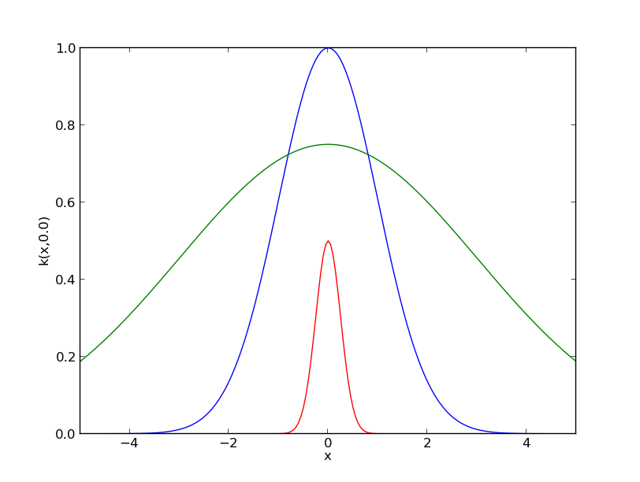
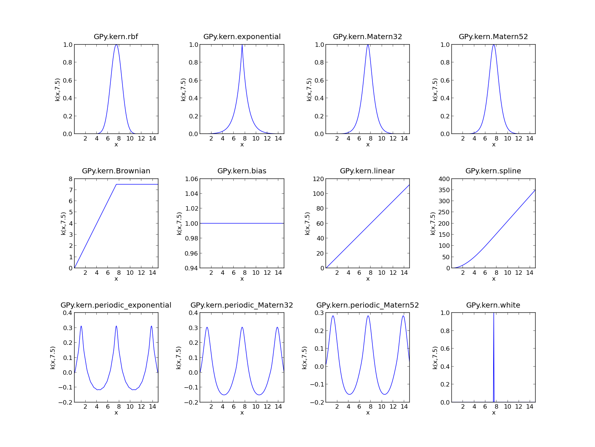
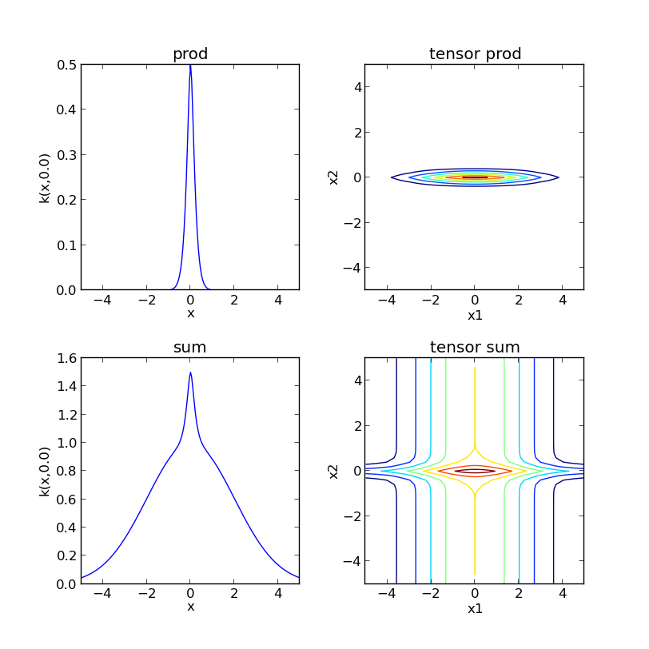
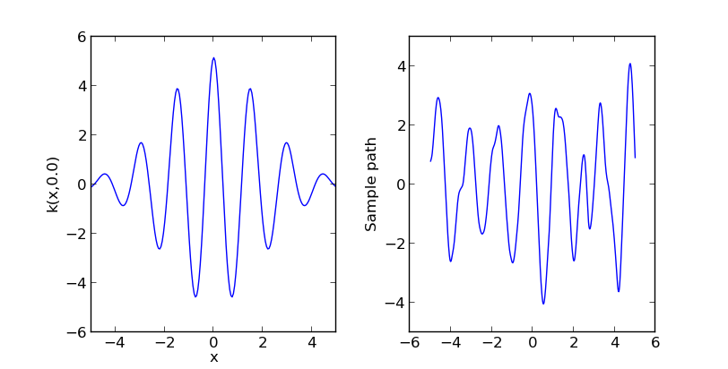
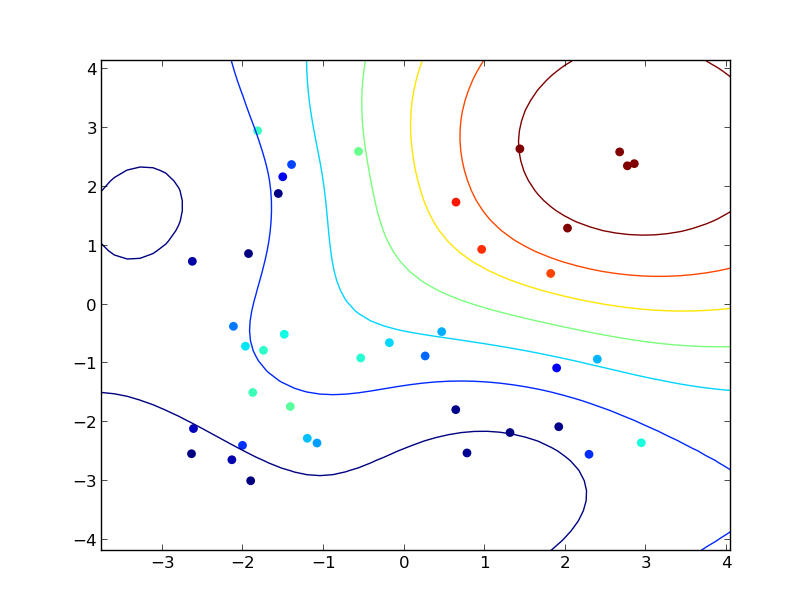
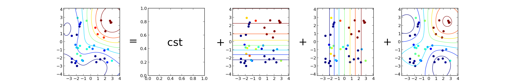

****************************
tutorial : A kernel overview
****************************

First we import the libraries we will need ::

    import pylab as pb
    import numpy as np
    import GPy
    pb.ion()

For most kernels, the dimension is the only mandatory parameter to define a kernel object. However, it is also possible to specify the values of the parameters. For example, the three following commands are valid for defining a squared exponential kernel (ie rbf or Gaussian) ::

    ker1 = GPy.kern.rbf(1)  # Equivalent to ker1 = GPy.kern.rbf(D=1, variance=1., lengthscale=1.)
    ker2 = GPy.kern.rbf(D=1, variance = .75, lengthscale=2.)
    ker3 = GPy.kern.rbf(1, .5, .5)

A ``print`` and a ``plot`` functions are implemented to represent kernel objects. The commands ::
    
    print ker2

    ker1.plot()
    ker2.plot()
    ker3.plot()

return::

           Name        |  Value   |  Constraints  |  Ties  
    -------------------------------------------------------
       rbf_variance    |  0.7500  |               |        
      rbf_lengthscale  |  2.0000  |               |        

Implemented kernels
===================

Many kernels are already implemented in GPy. Here is a summary of most of them:

On the other hand, it is possible to use the `sympy` package to build new kernels. This will be the subject of another tutorial.    

Operations to combine kernels
=============================

In ``GPy``, kernel objects can be added or multiplied. In both cases, two kinds of operations are possible since one can assume that the kernels to add/multiply are defined on the same space or on different subspaces. In other words, it is possible to use two kernels :math:`k_1,\ k_2` over :math:`\mathbb{R} \times \mathbb{R}` to create 

    * a kernel over :math:`\mathbb{R} \times \mathbb{R}`:  :math:`k(x,y) = k_1(x,y) \times k_2(x,y)`
    * a kernel over :math:`\mathbb{R}^2 \times \mathbb{R}^2`:  :math:`k(\mathbf{x},\mathbf{y}) = k_1(x_1,y_1) \times k_2(x_2,y_2)`

These two options are available in GPy under the name ``prod`` and ``prod_orthogonal`` (resp. ``add`` and ``add_orthogonal`` for the addition). Here is a quick example ::

    k1 = GPy.kern.rbf(1,1.,2.)
    k2 = GPy.kern.Matern32(1, 0.5, 0.2)

    # Product of kernels
    k_prod = k1.prod(k2)
    k_prodorth = k1.prod_orthogonal(k2)

    # Sum of kernels
    k_add = k1.add(k2)
    k_addorth = k1.add_orthogonal(k2)    

..  # plots
    pb.figure(figsize=(8,8))
    pb.subplot(2,2,1)
    k_prod.plot()
    pb.title('prod')
    pb.subplot(2,2,2)
    k_prodorth.plot()
    pb.title('prod_orthogonal')
    pb.subplot(2,2,3)
    k_add.plot()
    pb.title('add')
    pb.subplot(2,2,4)
    k_addorth.plot()
    pb.title('add_orthogonal')
    pb.subplots_adjust(wspace=0.3, hspace=0.3)

A shortcut for ``add`` and ``prod`` is provided by the usual ``+`` and ``*`` operators. Here is another example where we create a periodic kernel with some decay ::
    
    k1 = GPy.kern.rbf(1,1.,2)
    k2 = GPy.kern.periodic_Matern52(1,variance=1e3, lengthscale=1, period = 1.5, lower=-5., upper = 5)

    k = k1 * k2  # equivalent to k = k1.prod(k2)
    print k

    # Simulate sample paths
    X = np.linspace(-5,5,501)[:,None]
    Y = np.random.multivariate_normal(np.zeros(501),k.K(X),1)

..  # plot
    pb.figure(figsize=(10,4))
    pb.subplot(1,2,1)
    k.plot()
    pb.subplot(1,2,2)
    pb.plot(X,Y.T)
    pb.ylabel("Sample path")
    pb.subplots_adjust(wspace=0.3)

In general, ``kern`` objects can be seen as a sum of ``kernparts`` objects, where the later are covariance functions denied on the same space. For example, the following code ::

    k = (k1+k2)*(k1+k2)
    print k.parts[0].name, '\n', k.parts[1].name, '\n', k.parts[2].name, '\n', k.parts[3].name

returns ::

    rbf<times>rbf 
    rbf<times>periodic_Mat52 
    periodic_Mat52<times>rbf 
    periodic_Mat52<times>periodic_Mat52

Constraining the parameters
===========================

Various constrains can be applied to the parameters of a kernel

    * ``constrain_fixed`` to fix the value of a parameter (the value will not be modified during optimisation)
    * ``constrain_positive`` to make sure the parameter is greater than 0.
    * ``constrain_bounded`` to impose the parameter to be in a given range.
    * ``tie_param`` to impose the value of two (or more) parameters to be equal.

When calling one of these functions, the parameters to constrain can either by specified by a regular expression that matches its name or by a number that corresponds to the rank of the parameter. Here is an example ::

    k1 = GPy.kern.rbf(1)
    k2 = GPy.kern.Matern32(1)
    k3 = GPy.kern.white(1)

    k = k1 + k2 + k3
    print k

    k.constrain_positive('var')
    k.constrain_fixed(np.array([1]),1.75)
    k.tie_param('len')
    k.unconstrain('white')
    k.constrain_bounded('white',lower=1e-5,upper=.5)
    print k
    
with output::

            Name         |  Value   |  Constraints  |  Ties  
    ---------------------------------------------------------
        rbf_variance     |  1.0000  |               |        
       rbf_lengthscale   |  1.0000  |               |        
       Mat32_variance    |  1.0000  |               |        
      Mat32_lengthscale  |  1.0000  |               |        
       white_variance    |  1.0000  |               |        
    
    
            Name         |  Value   |  Constraints   |  Ties  
    ----------------------------------------------------------
        rbf_variance     |  1.0000  |     (+ve)      |        
       rbf_lengthscale   |  1.7500  |     Fixed      |  (0)   
       Mat32_variance    |  1.0000  |     (+ve)      |        
      Mat32_lengthscale  |  1.7500  |                |  (0)   
       white_variance    |  0.3655  |  (1e-05, 0.5)  |        
  

Example : Building an ANOVA kernel
==================================

In two dimensions ANOVA kernels have the following form: 

.. math::

    k_{ANOVA}(x,y) = \prod_{i=1}^2 (1 + k_i(x_i,y_i)) = 1 + k_1(x_1,y_1) + k_2(x_2,y_2) + k_1(x_1,y_1) \times k_2(x_2,y_2).

Let us assume that we want to define an ANOVA kernel with a Matern 3/2 kernel for :math:`k_i`. As seen previously, we can define this kernel as follows ::

    k_cst = GPy.kern.bias(1,variance=1.)
    k_mat = GPy.kern.Matern52(1,variance=1., lengthscale=3)
    Kanova = (k_cst + k_mat).prod_orthogonal(k_cst + k_mat)
    print Kanova

Printing the resulting kernel outputs the following ::

                     Name                  |  Value   |  Constraints  |  Ties  
    ---------------------------------------------------------------------------
         bias<times>bias_bias_variance     |  1.0000  |               |  (0)   
         bias<times>bias_bias_variance     |  1.0000  |               |  (3)   
        bias<times>Mat52_bias_variance     |  1.0000  |               |  (0)   
        bias<times>Mat52_Mat52_variance    |  1.0000  |               |  (4)   
      bias<times>Mat52_Mat52_lengthscale   |  3.0000  |               |  (5)   
        Mat52<times>bias_Mat52_variance    |  1.0000  |               |  (1)   
      Mat52<times>bias_Mat52_lengthscale   |  3.0000  |               |  (2)   
        Mat52<times>bias_bias_variance     |  1.0000  |               |  (3)   
       Mat52<times>Mat52_Mat52_variance    |  1.0000  |               |  (1)   
      Mat52<times>Mat52_Mat52_lengthscale  |  3.0000  |               |  (2)   
       Mat52<times>Mat52_Mat52_variance    |  1.0000  |               |  (4)   
      Mat52<times>Mat52_Mat52_lengthscale  |  3.0000  |               |  (5)   

Note the ties between the parameters of ``Kanova`` that reflect the links between the parameters of the kernparts objects. We can illustrate the use of this kernel on a toy example::

    # sample inputs and outputs
    X = np.random.uniform(-3.,3.,(40,2))
    Y = 0.5*X[:,:1] + 0.5*X[:,1:] + 2*np.sin(X[:,:1]) * np.sin(X[:,1:])

    # Create GP regression model
    m = GPy.models.GP_regression(X,Y,Kanova)
    pb.figure(figsize=(5,5))
    m.plot()

As :math:`k_{ANOVA}` corresponds to the sum of 4 kernels, the best predictor can be splited in a sum of 4 functions 

.. math::

    bp(x) & = k(x)^t K^{-1} Y \\
          & = (1 + k_1(x_1) +  k_2(x_2) +  k_1(x_1)k_2(x_2))^t K^{-1} Y \\
          & = 1^t K^{-1} Y + k_1(x_1)^t K^{-1} Y + k_2(x_2)^t K^{-1} Y + (k_1(x_1)k_2(x_2))^t K^{-1} Y

The submodels can be represented with the option ``which_function`` of ``plot``: ::
    
    pb.figure(figsize=(20,3))
    pb.subplots_adjust(wspace=0.5)
    pb.subplot(1,5,1)
    m.plot()
    pb.subplot(1,5,2)
    pb.ylabel("=   ",rotation='horizontal',fontsize='30')
    pb.subplot(1,5,3)
    m.plot(which_functions=[False,True,False,False])
    pb.ylabel("cst          +",rotation='horizontal',fontsize='30')
    pb.subplot(1,5,4)
    m.plot(which_functions=[False,False,True,False])
    pb.ylabel("+   ",rotation='horizontal',fontsize='30')
    pb.subplot(1,5,5)
    pb.ylabel("+   ",rotation='horizontal',fontsize='30')
    m.plot(which_functions=[False,False,False,True])

..  pb.savefig('tuto_kern_overview_mANOVAdec.png',bbox_inches='tight')

..  import pylab as pb
    import numpy as np
    import GPy
    pb.ion()

    ker1 = GPy.kern.rbf(D=1)  # Equivalent to ker1 = GPy.kern.rbf(D=1, variance=1., lengthscale=1.)
    ker2 = GPy.kern.rbf(D=1, variance = .75, lengthscale=3.)
    ker3 = GPy.kern.rbf(1, .5, .25)

    ker1.plot()
    ker2.plot()
    ker3.plot()
    #pb.savefig("Figures/tuto_kern_overview_basicdef.png")

    kernels = [GPy.kern.rbf(1), GPy.kern.exponential(1), GPy.kern.Matern32(1), GPy.kern.Matern52(1),  GPy.kern.Brownian(1), GPy.kern.bias(1), GPy.kern.linear(1), GPy.kern.spline(1), GPy.kern.periodic_exponential(1), GPy.kern.periodic_Matern32(1), GPy.kern.periodic_Matern52(1), GPy.kern.white(1)]
    kernel_names = ["GPy.kern.rbf", "GPy.kern.exponential", "GPy.kern.Matern32", "GPy.kern.Matern52", "GPy.kern.Brownian", "GPy.kern.bias", "GPy.kern.linear", "GPy.kern.spline", "GPy.kern.periodic_exponential", "GPy.kern.periodic_Matern32", "GPy.kern.periodic_Matern52", "GPy.kern.white"]
    
    pb.figure(figsize=(16,12))
    pb.subplots_adjust(wspace=.5, hspace=.5)
    for i, kern in enumerate(kernels):
       pb.subplot(3,4,i+1)
       kern.plot(x=7.5,plot_limits=[0.00001,15.])
       pb.title(kernel_names[i]+ '\n')
       #pb.axes([.1,.1,.8,.7])
       #pb.figtext(.5,.9,'Foo Bar', fontsize=18, ha='center')
       #pb.figtext(.5,.85,'Lorem ipsum dolor sit amet, consectetur adipiscing elit',fontsize=10,ha='center')

    # actual plot for the noise
    i = 11
    X = np.linspace(0.,15.,201)
    WN = 0*X
    WN[100] = 1.
    pb.subplot(3,4,i+1)
    pb.plot(X,WN,'b')
